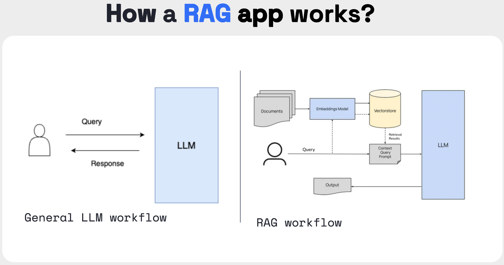

# OpenZeppelin LLM Agent powered by GaiaNet with RAG

This project leverages **GaiaNet** to build a **Retrieval Augmented Generation (RAG)**-based Large Language Model (LLM) agent for OpenZeppelin, a widely used smart contract library. 

**Retrieval Augmented Generation (RAG)** is a framework designed to mitigate the hallucination problem of LLMs by integrating external resources, enabling the personalization of LLM agents based on domain-specific knowledge. The project setup involves the following components:

- A regular LLM
- An embedding model
- A vector database
- An API server application



## Project Highlights

By leveraging GaiaNet's decentralized knowledge graph, this project solves several key issues faced by traditional LLM agents:

- **Accurate retrieval of domain-specific knowledge**: Reduces LLM hallucinations by retrieving real-time, verified information from OpenZeppelin’s documentation.
- **Scalability and flexibility**: GaiaNet’s decentralized infrastructure allows you to scale the LLM agent while maintaining high-quality, domain-specific responses.
- **Personalization**: The LLM agent is personalized for OpenZeppelin, ensuring users receive accurate responses tailored to smart contract development.

## Why GaiaNet?

GaiaNet offers several advantages for building and deploying LLM agents:

1. **Decentralization**: GaiaNet ensures robust, decentralized access to various knowledge sources without relying on a single central entity, reducing the risk of data unavailability.
2. **Scalability**: With GaiaNet’s distributed nodes, the solution can handle growing knowledge bases and increasing queries without compromising on speed or accuracy.
3. **Customizability**: GaiaNet allows developers to integrate their own knowledge snapshots, facilitating the creation of highly specific LLM agents, such as for OpenZeppelin.
4. **Seamless integration with RAG**: GaiaNet is designed to support retrieval-augmented generation, allowing you to efficiently utilize external data in LLM responses.

## Implementation Steps

### 1. Set up a GaiaNet Node
To start, you will need to set up a GaiaNet node on your local machine or server. You can follow the official [Quick start with GaiaNet Node](https://docs.gaianet.ai/node-guide/quick-start) to get started.

### 2. Crawl OpenZeppelin Data Using [Firecrawl](https://www.firecrawl.dev/)

The next step is to crawl OpenZeppelin's official documentation and generate markdown files. We use the open-source project **Firecrawl** for this purpose:

- Install and set up Firecrawl locally by following the steps from its [GitHub repository](https://github.com/mendableai/firecrawl/tree/main).
- Use Firecrawl to crawl OpenZeppelin’s official documentation and output the content in markdown format. Here’s an example of how to set up and use Firecrawl:

  ```bash
  # Clone the Firecrawl repository
  git clone https://github.com/mendableai/firecrawl.git
  cd firecrawl

  # Install dependencies
  npm install

  # Start the Firecrawl service
  npm run start

  # Use Firecrawl to crawl OpenZeppelin's documentation and save it as markdown
  curl -X POST -H "Content-Type: application/json" \
    -d '{"url": "https://docs.openzeppelin.com/", "outputFormat": "markdown"}' \
    http://localhost:4000/api/crawl
  ```

  After running the command, you will get the OpenZeppelin documentation in markdown format.

### 3. Convert Markdown to [Snapshot](https://docs.gaianet.ai/creator-guide/knowledge/markdown)

Once you have the markdown files from Firecrawl, you need to convert them into a vector collection snapshot:

```bash
wasmedge --dir .:. \
  --nn-preload embedding:GGML:AUTO:nomic-embed-text-v1.5.f16.gguf \
  markdown_embed.wasm embedding default 768 openzeppelin-docs.md --heading_level 2 --ctx_size 4096 --maximum_context_length 2048
```

This command creates the vector embedding snapshot of the crawled OpenZeppelin documentation.

### 4. [Customize Node Configuration](https://docs.gaianet.ai/node-guide/customize)

In the next step, customize your GaiaNet node to include the snapshot you generated in the previous step as part of the knowledge base. Add the snapshot to your node configuration so it can be used by the LLM for retrieval.

### 5. Validate the Model

Finally, you need to validate the performance of the LLM agent by querying it for OpenZeppelin-related topics and ensuring it responds accurately using the knowledge base created from the crawled data.

You can test this by interacting with the API server and ensuring that the responses come directly from the embedded knowledge snapshot.